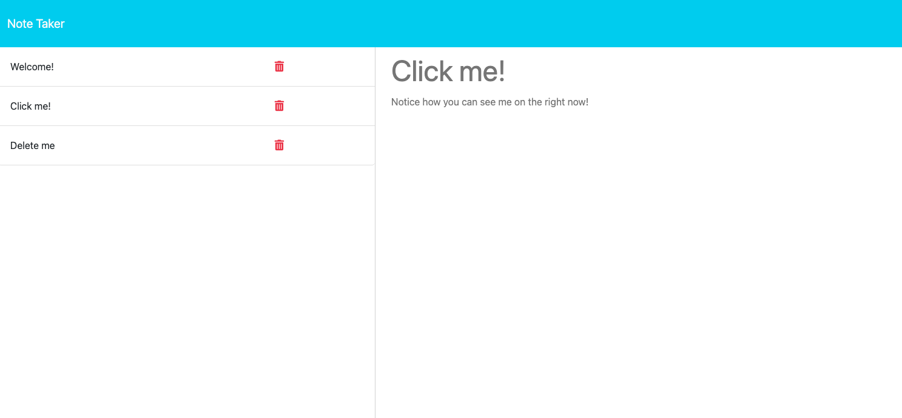

# Note Taker

## _Table of Contents_

- [Description](#description)
- [Tools](#tools)
- [Motivation](#motivation)
- [Installation](#installation)
- [Usage](#usage)
- [Contribution](#contribution)
- [Testing](#testing)
- [License](#license)
- [Screenshots](#screenshots)
- [Questions](#questions)

## **Description**

A note taking app that allows users to create, update, and delete notes.

## **Tools**

- Express
- Javascript
- Node
- Railway

## **Motivation**

I recently learned how backend technologies like express and server-side APIs play a crucial role in today's web dev ecosystem. I wanted to test my new skills and reinforce what I've been learning by building my first server and deploying it to a platform.

## **Installation**

N/A

## **Usage**

Type a note, click save, delete note if you need to.

## **Contribution**

See contact information below

## **Testing**

N/A

## **Screenshots**

## **Links**

Live site below:

[Note Taker](https://note-taker-production-2d5e.up.railway.app/)

## License

This project is licensed under the terms of the MIT license.

Detailed information about this license can be found here: [License Info](https://choosealicense.com/licenses/mit)

## Questions

Any question about this project contact me here:

- [Github](https://github.com/valentacodes)
- <valentacodes@gmail.com>
